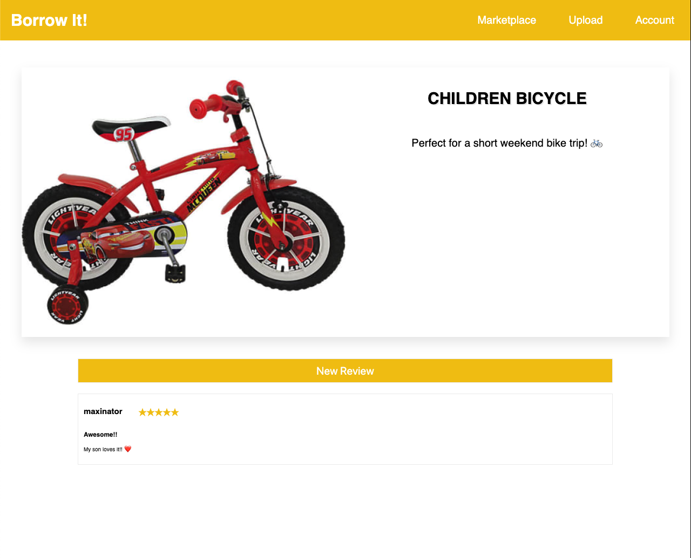
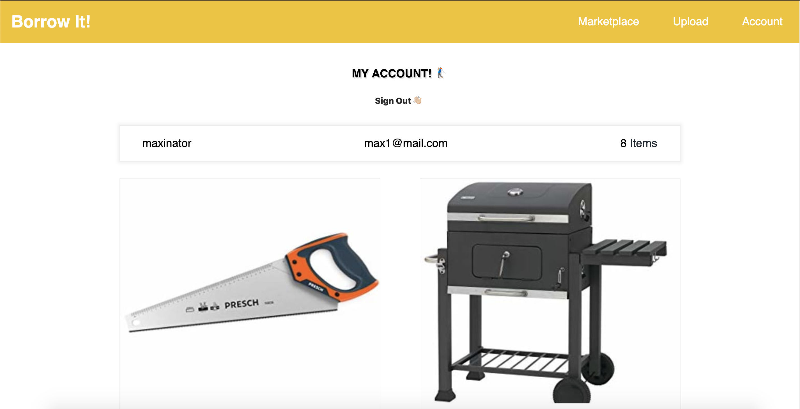
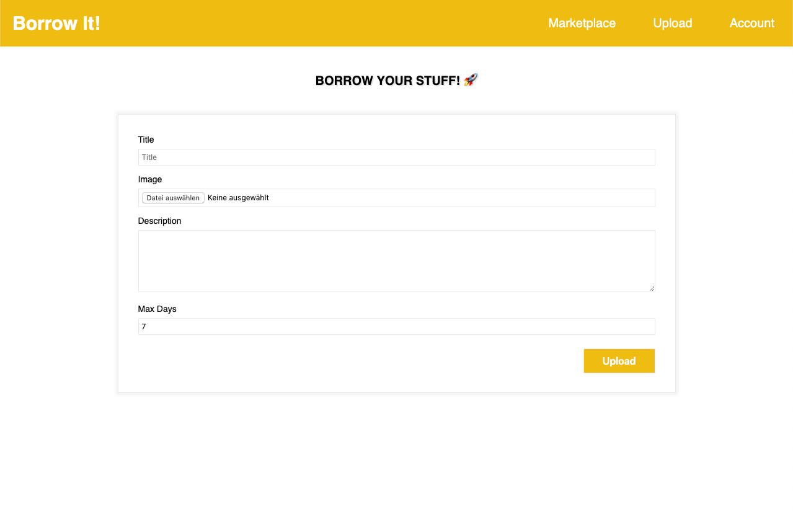

# borrow-it ↔️

## In development 💻

This project is just for learning purposes. I build it to get started with **GraphQL** and imporve my **React** skills.

## The idea 💡

_Borrow it_ is an online platform to lend your stuff and borrow things you need. User can upload items. review items they borrowed and so on.

## The stack 📚

The backend is devided in two pieces. **Prisma** and a **GraphQL Yoga 🧘🏼‍** server. **Prisma** sits between the Database and the **Yoga** server. 

For building the interface I use **Next.js**. A **React** framework for _Server-Rendered Apps_. The data managemend is handled by **Apollo Client**.

The focus of this project isn't to build the perfect styled and production ready application. I just want to learn how all these awesome tools work together. 🔥

## Screenhots

### An item with a review:

### The account page of an user:

### The form to upload an item:
